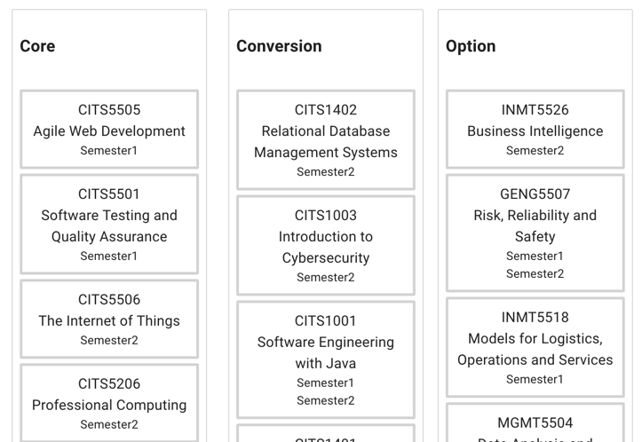
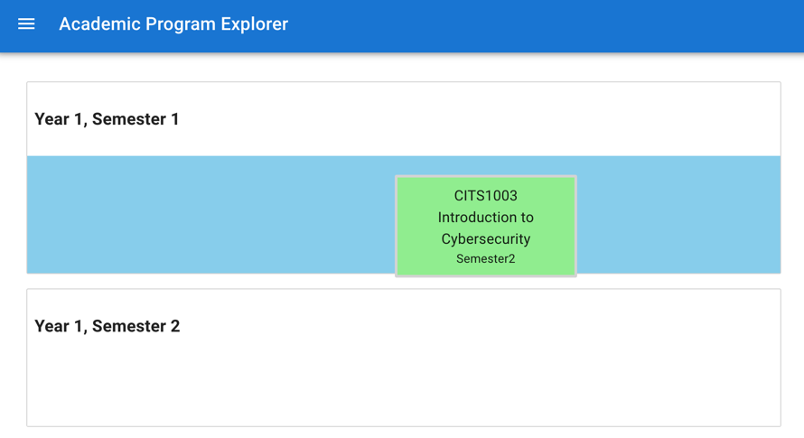

# Academic Program Explorer

### Create a sample study plan

#### Dragging Rules & Restrictions

**Units cannot be dragged into semesters that they are incompatible with. A semester cannot have more than 4 units at a time. Units cannot be dragged back into their original Core / Converion / Optional unit type box.**

Below is a screenshot of the **Core**, **Conversion**, and **Optional** unit types, displayed at the bottom of the study planner. You will find you are unable to drag these units bewteen each unit type.

*Note: Future updates will include having the unit type written within the unit itself, and having each unit type given its own colour so they are more easily identifiable. Based on client feedback, it is quite possible all unit types will share the same drop box as well, and be located to the left of the semesters.*

When you drag a unit, you are given a blue drag area letting you know where the drop zone is. If you drag an incompatible unit into a semster that is not compatible as shown below, the unit will return to its origin, and you will be given an unobtrusive notification.

Below is the notification you are given when assigning a unit to an incompatible semester. Future features will include these messages also showing whenever the use should be notified of any behaviour that may not be obvious.

Below is what is shown when a unit is successfully placed into a semester.

