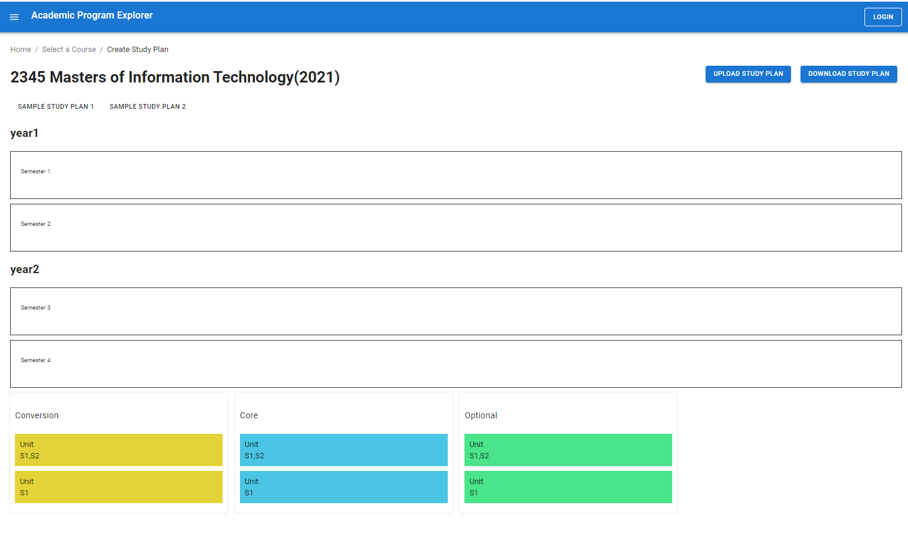
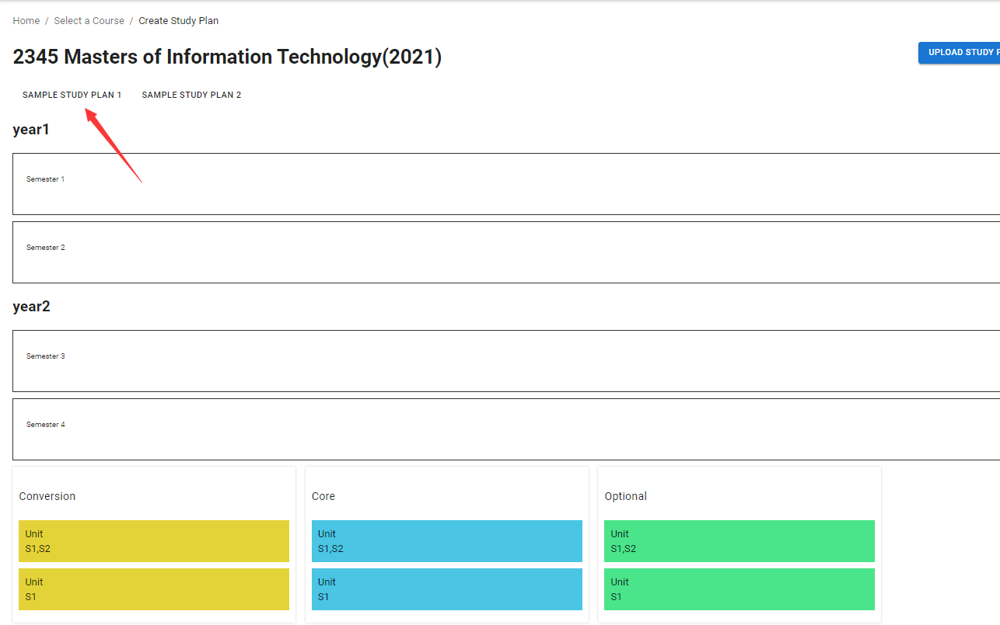
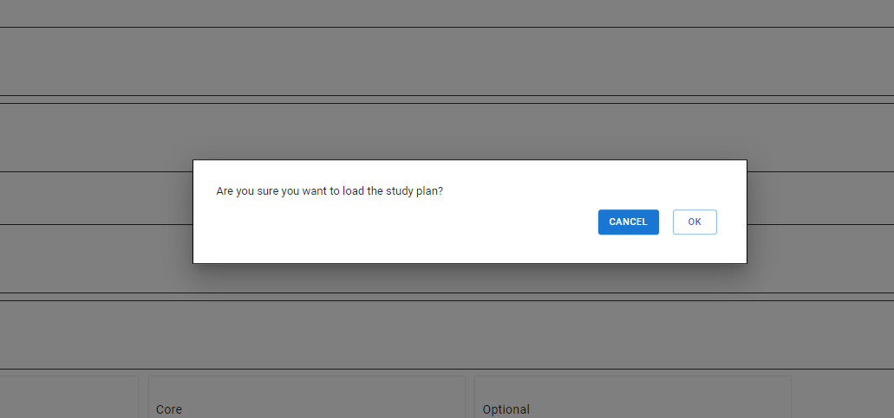
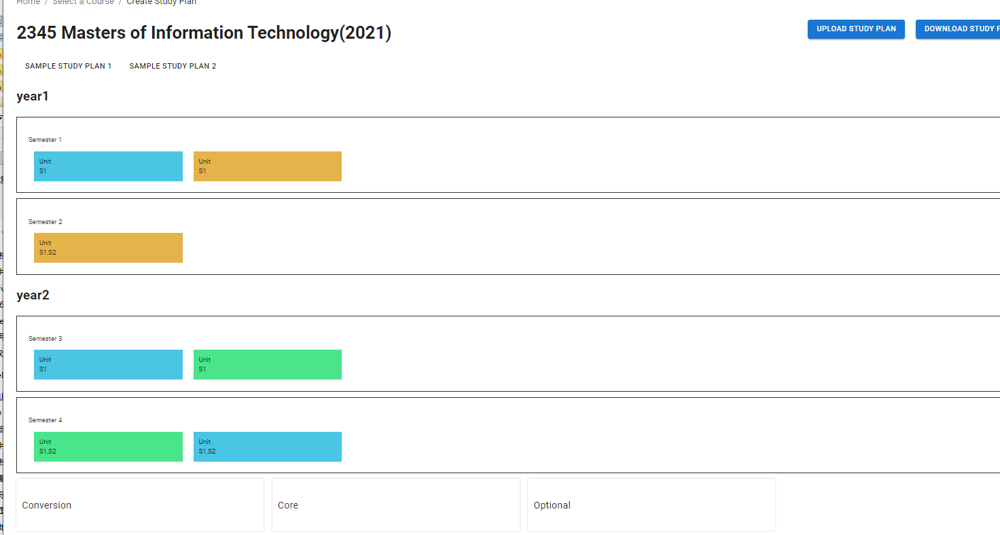

Page display

> The page is located at the  `src\components\Welcome`

Get the content with mock data, and then render the list of data in the form of an Axios call interface

data position：src\mock\initial-data.js

That interface：src\mock\index.js

- Mock interface data is obtained in the interface via AXIos

And then render the page

click on the button

The following pop-ups appear

When I hit OK

Display the content and wipe out the original data
