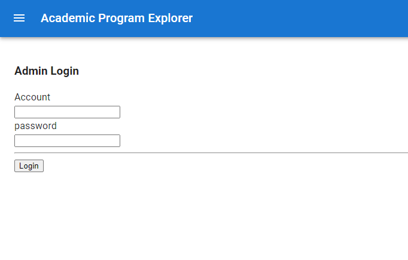
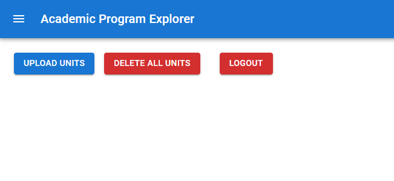

# User Manual for the Admin Login page

This is an instruction for users about Admin Login page and other related pages.

## Introduction of the feature

The Admin Login page is used for the login and authentication.\
After acquiring the account and password, the admin of this system can login with this page and access to the admin system, where the admin can update and delete courses.

## Guide 

After starting the whole system with the command `npm start` at your command line:
<pre>npm start</pre>
Open [http://localhost:3000/login](http://localhost:3000/login) to view the login page for the admin.\

<i>Admin</i> &nbsp &nbsp &nbsp &nbsp <== Click this

<b>Account</b>: admin\
<b>Password</b>: uwaadmin

 

After being an admin and getting the account, you can easily login at this page and get the access to the [Admin System](http://localhost:3000/admin).

<b>Note</b>: If you have not obtained the admin account, you will not be authenticated to get to the admin system. On the contrary, if you have already passed once, you will be redirected onto the admin system without login next time.

/**\
At the admin course system, you will find some features about updating and deleting units, those features will be introducted in other guide files.\
*/\
The <b>key point</b> is when you click the logout button at that page, you will be redirected back to the login page and the local storage of your admin account will be cleared. That means you will need to start from the login page when you try to get to the admin system next time.

